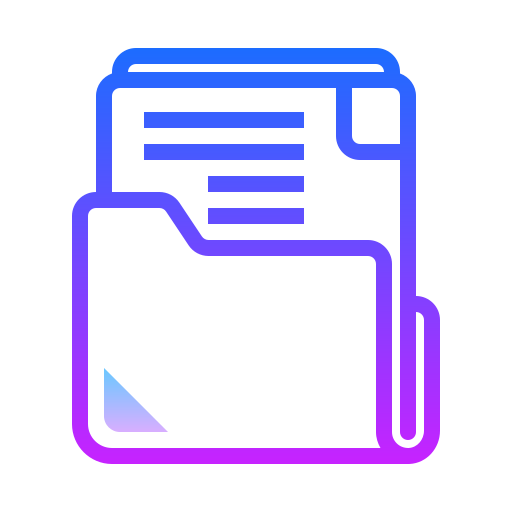

[![Forks][forks-shield]][forks-url]
[![Stargazers][stars-shield]][stars-url]
[![Issues][issues-shield]][issues-url]

<!-- PROJECT LOGO -->
<br />
<div align="center">
  <a href="https://github.com/jeezusplays/README-template">
    
  </a>

<h3 align="center">Trollbusters</h3>

  <p align="center">
    Easy to Use README Template for all your projects!
    <br />
    <a href="https://github.com/jeezusplays/README-template"><strong>Explore the docs »</strong></a>
    <br />
    <br />
    <a href="https://github.com/jeezusplays/README-template">View Demo</a>
    ·
    <a href="https://github.com/jeezusplays/README-template/issues">Report Bug</a>
    ·
    <a href="https://github.com/jeezusplays/README-template/issues">Request Feature</a>
  </p>
</div>


## About


## Built With
### Major Frameworks / Libraries 


## Getting Started
### Prerequisites

### Installation
1. Clone the repo
   ```sh
   git clone https://github.com/jeezusplays/trollbusters
    ```
2. Navigate to the project directory.
    ```sh
    cd trollbusters
    ```
3. Install NPM packages (if applicable)
   ```sh
   npm install
   ```
3. Start the development server.
    ```sh
    npm start
    ```
4. Open the project in your browser.
    ```sh
    open http://localhost:3000
    ```

## Usage
To use the application, follow these steps:
1. Open the application in a web browser.
2. Follow the on-screen instructions to navigate through the application's features.
3. If prompted, enter any required input values or select desired options.
4. When finished, exit the application or close the web browser.

## Contributing
If you have a suggestion that would make this better, please fork the repo and create a pull request. You can also simply open an issue with the tag "enhancement".
**Don't forget to give the project a :star: star :star:!** Thanks again!

1. Fork the Project
2. Create your Feature Branch (`git checkout -b /newFeature`)
3. Commit your Changes (`git commit -m 'Add some newFeature'`)
4. Push to the Branch (`git push origin /newFeature`)
5. Open a Pull Request

## License
Distributed under the MIT License. See [`LICENSE`](https://github.com/jeezusplays/README-Template/blob/main/LICENSE) for more information.

## Contact
Feel free to contact and connect!

|| Name | Github | LinkedIn |
|-----------| ----------- | ----------- | ----------- |
|</img>|Joey|[](https://github.com/jeezusplays)|[](https://linkedin.com/in/joey-tan-zuyi)|

## Acknowledgements
_Use this space to list resources you find helpful and would like to give credit to._

Examples:
* [Choose an Open Source License](https://choosealicense.com)
* [GitHub Emoji Cheat Sheet](https://www.webpagefx.com/tools/emoji-cheat-sheet)
* [Malven's Flexbox Cheatsheet](https://flexbox.malven.co/)
* [Malven's Grid Cheatsheet](https://grid.malven.co/)
* [Img Shields](https://shields.io)
* [Font Awesome](https://fontawesome.com)
* [Github Profile Badges](https://home.aveek.io/GitHub-Profile-Badges/)


[forks-shield]: https://img.shields.io/github/forks/jeezusplays/trollbusters.svg?style=for-the-badge
[forks-url]: https://github.com/jeezusplays/trollbusters/network/members
[stars-shield]: https://img.shields.io/github/stars/jeezusplays/trollbusters.svg?style=for-the-badge
[stars-url]: https://github.com/jeezusplays/trollbusters/stargazers
[issues-shield]: https://img.shields.io/github/issues/jeezusplays/trollbusters.svg?style=for-the-badge
[issues-url]: https://github.com/jeezusplays/trollbusters/issues
